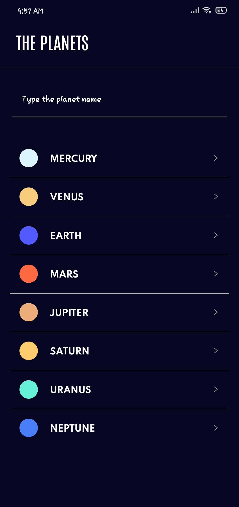

# PlanetApp

* Clone this repository and command npm install
* After installation, command expo start (need to install expo on your machine)
* Scan the QR code from terminal by your phone through EXPO go apps which you can found on Play Store
* BOOM!!

