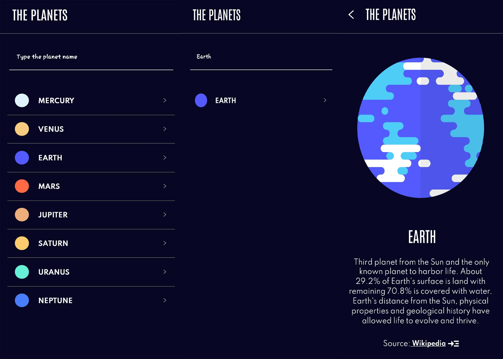

# PlanetApp

* Clone this repository and command npm install
* After installation, command expo start (need to install expo on your machine)
* Scan the QR code from terminal by your phone through EXPO go apps which you can found on Play Store
* BOOM!!
## Eas Build
* https://expo.dev/accounts/mahir250/projects/planetApp/builds/dbed7a7b-5985-4f1e-a307-4a0e5fccc9d8

